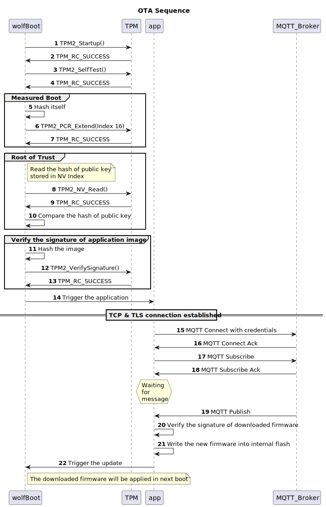

# OTA Demonstrator with wolfBoot, wolfTPM and wolfMQTT

## Overview
This demonstrator shows a general over-the-air firmware update workflow secured by wolfSSL products and TPM.\
It uses the following products:

 - wolfBoot: Secure boot loader. ([Home page](https://www.wolfssl.com/products/wolfboot/))
 - wolfTPM: TPM library. ([Home page](https://www.wolfssl.com/products/wolftpm/)) 
 - wolfMQTT: MQTT library. ([Home page](https://www.wolfssl.com/products/wolfmqtt/))
 - wolfSSL: Secure TLS/SSL library. ([Home page](https://www.wolfssl.com/products/wolfssl/))
 - wolfCrypt: Cryptography engine. ([Home page](https://www.wolfssl.com/products/wolfcrypt-2/))

## Prerequisites
This demonstrator uses a software TPM to simulate TPM functionality.\
For details, see [SWTPM simulator setup](https://www.wolfssl.com/documentation/manuals/wolftpm/chapter02.html#swtpm-simulator-setup).\
Alternatively, you can use the [.devcontainer](https://code.visualstudio.com/docs/devcontainers/containers), which builds the software TPM from the official repository: [ibmswtpm2](https://github.com/kgoldman/ibmswtpm2.git).

## How to Build
First, initialize the git submodules.
```
git submodule update --init --recursive
```
**You need to run swtpm before initializing the TPM tools so the hash of the public key can be stored in the NV index.**
Then build each module as follows.

1. Build the TPM tools and initialize swtpm
```
cd ./wolfBoot
make tpmtools
./tools/tpm/rot -write
cd ./tools/bin-assemble
make
```
2. Build wolfSSL
```
cd ./wolfBoot/lib/wolfssl/
./autogen.sh
./configure --disable-shared --enable-wolftpm
make -j
make install
```
3. Build wolfTPM
```
cd ./wolfBoot/lib/wolfTPM/
./autogen.sh
./configure --disable-shared --enable-swtpm
make -j
make install
```
4. Build wolfMQTT
```
cd ./wolfMQTT
./autogen.sh
./configure --disable-shared
make -j
```  
5. Build wolfBoot and the application
```
make test-sim-internal-flash-with-update V=1
```
6. Build the OTA server app
```
make fwserver/fwserver
```

## How to Run
### OTA
1. Run swtpm. If you are using a devcontainer, run:
   ```
   /opt/ibmswtpm2/src/tpm_server
   ```
2. From another terminal, run:
   ```
   ./wolfBoot/wolfboot.elf get_version
   ```
   This command lets wolfBoot start the application and prints the firmware version (default: 1).
3. Trigger the OTA flow with the `ota` command:
   ```
   ./wolfBoot/wolfboot.elf ota
   ```
   The application booted by wolfBoot starts the OTA flow. Once OTA starts, the application connects to the MQTT broker and subscribes to the firmware data topic, then waits for messages.
4. Open another terminal and run:
   ```
   ./fwserver/fwserver -t
   ```
   This tool emulates the OTA server and sends the new firmware to the MQTT broker.
5. The application receives the MQTT message and verifies it. Finally, the firmware is stored in internal flash and the update is triggered by wolfBoot.
6. Run:
   ```
   ./wolfBoot/wolfboot.elf get_version
   ```
   The application shows the new firmware version (default: 10).

### Attestation
You can try part of the remote attestation functionality.\
wolfBoot calculates its own hash and extends it to PCR 16. (Measured Boot)
Then the application requests a quote from swtpm with this command:
```
 ./wolfBoot/wolfboot.elf attestation
 ```

### Others
This demo app supports additional test commands.\
You can find them in `./app/app_sim.c`.

## Sequence Diagram


## Limitations on Mac environment
We use `objcopy` to prepare the file that emulates internal flash.\
However, macOS does not include `objcopy` by default.\
Please install it and set `OBJCOPY=` when you build the app and wolfBoot.\
Also, if wolfBoot runs in a native macOS environment, a temporary file named `test_app` is generated on each run.\
Please delete it after each run.